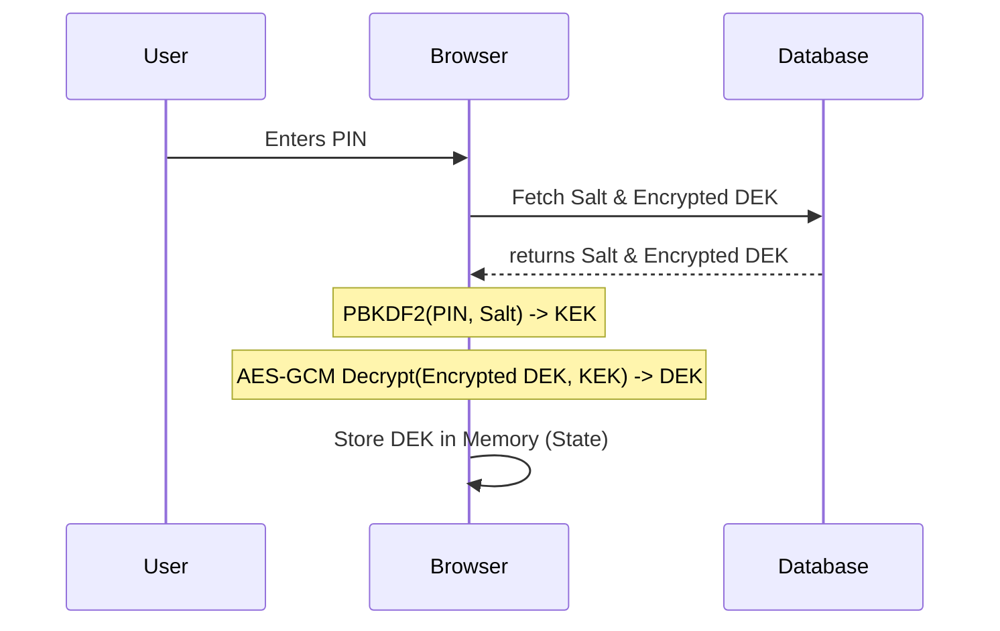
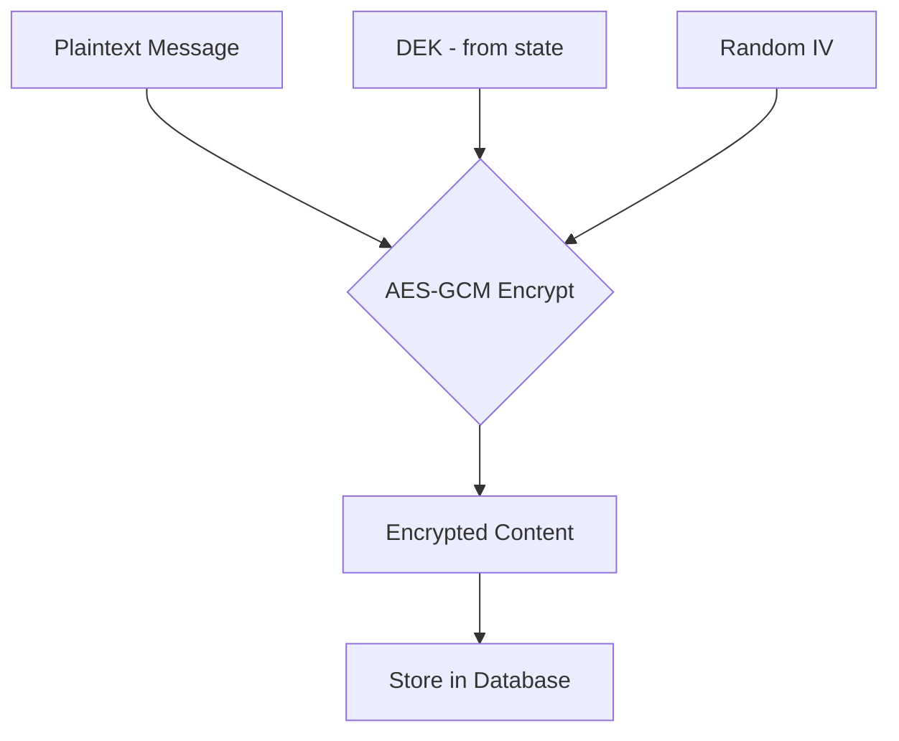

# Encryption Architecture

Baatein uses **End-to-End Encryption (E2EE)** to ensure that your messages and data are private. No one—not even the developers or the server—can access your content.

## The Strategy

Baatein employs a multi-layered encryption approach using the standard **Web Crypto API**:

1.  **DEK (Data Encryption Key):** A unique, randomly generated AES-256 key used to encrypt your actual messages and content.
2.  **KEK (Key Encryption Key):** A key derived from your personal **PIN**, used to encrypt the DEK.
3.  **Salt:** A random value combined with your PIN to prevent rainbow table attacks.

---

## Technical Details

### 1. Key Derivation (PIN to KEK)

When you set up or enter your PIN, we use the **PBKDF2** (Password-Based Key Derivation Function 2) algorithm to turn your PIN into a strong cryptographic key (KEK).

- **Algorithm:** PBKDF2
- **Hash:** SHA-256
- **Iterations:** 100,000
- **Salt:** 16-byte random value (unique per user)

### 2. Content Encryption

All sensitive data is encrypted using **AES-GCM** (Advanced Encryption Standard with Galois/Counter Mode), which provides both confidentiality and data integrity.

- **Algorithm:** AES-GCM
- **Key Length:** 256 bits
- **IV (Initialization Vector):** 12-byte random value unique for every encryption operation.

---

## Workflow Diagrams

### Setup / Unlock Flow

This diagram shows how your PIN is used to unlock the key that encrypts your messages.

### Encryption Flow

This diagram shows what happens when you send a message.

---

## Security Guarantees

- **No Plaintext Storage:** Your PIN and DEK are never sent to the server.
- **Server Blindness:** The database only stores the Salt and the _Encrypted_ DEK. Without your PIN, the server cannot derive the KEK, and therefore cannot decrypt the DEK or your messages.
- **Integrity:** AES-GCM ensures that if an encrypted message is tampered with, decryption will fail.

## Implementation References

- Core logic: [crypto.ts](lib/crypto.ts)
- Context Provider: [EncryptionProvider.tsx](components/features/EncryptionProvider.tsx)
